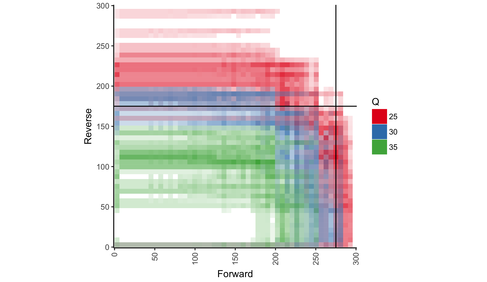
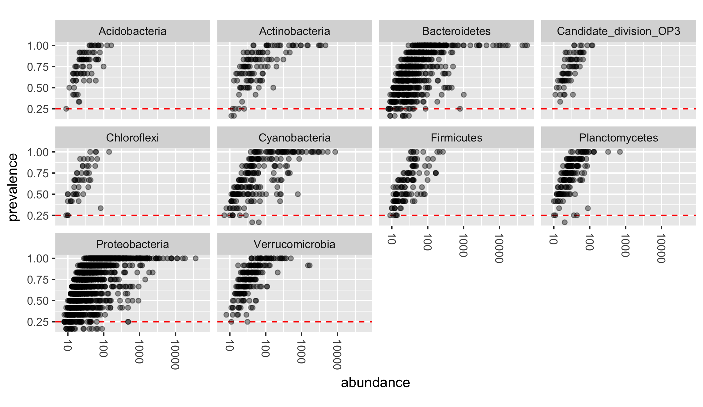
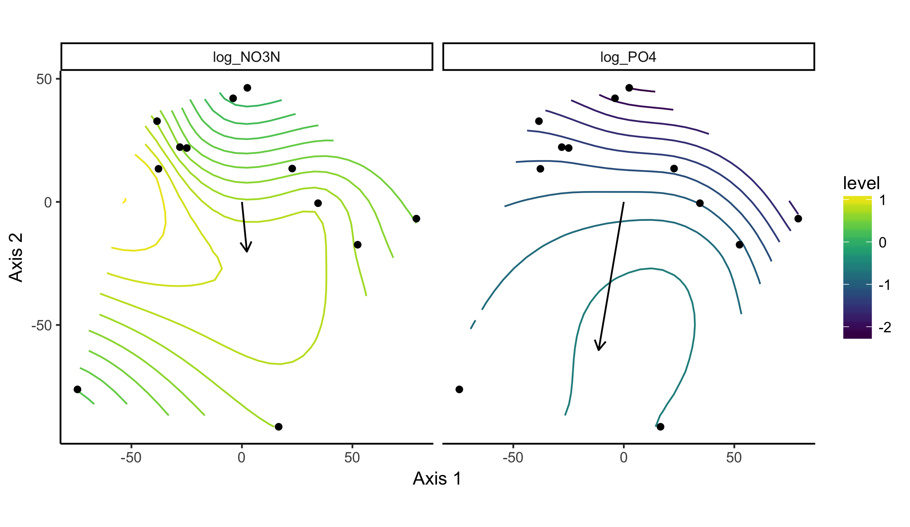
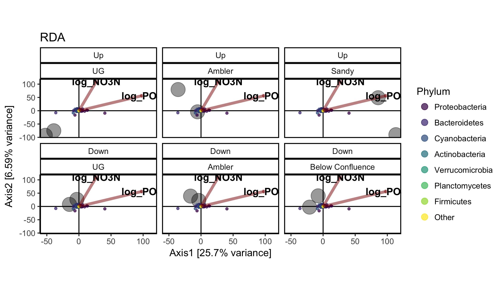
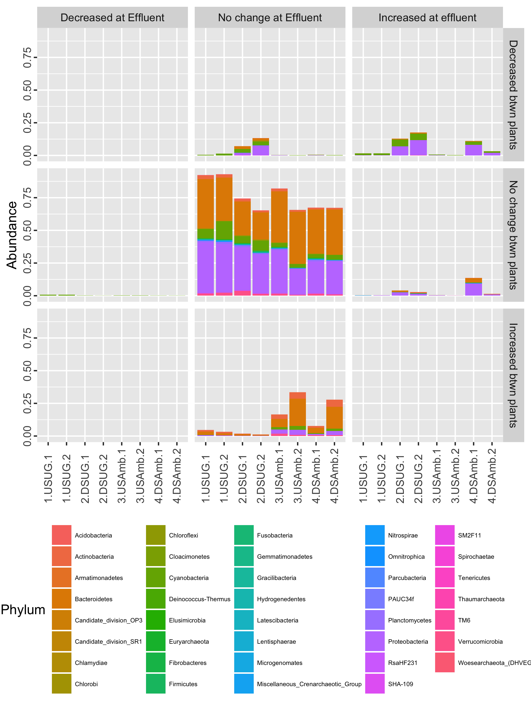

```{r,echo=FALSE}
knitr::opts_chunk$set(collapse=TRUE,comment='#>')
```
## Introduction  

We will be using the dataset **WWTP_Impact** from [Price et. al. (2017)](http://www.sciencedirect.com/science/article/pii/S0048969717325111) to illustrate the basic functionality within the *theseus* package. To get started, let's load *theseus*, *phyloseq*, and *ggplot2* and get the WWTP_Impact dataset.  

```{r,eval=FALSE}
library(theseus)
library(phyloseq)
library(ggplot2)

data('WWTP_Impact')
```

**WWTP_Impact** is a phyloseq object containing 16S rDNA amplicon sequencing data from samples collected at 6 sites on 2 days (12 total samples) along Wissahickon Creek and Sandy Run in southeastern Pennsylvania, USA. Sequencing data was processed as described in Price et. al. (2016), and combined with chemical data to create a phyloseq object. The raw data and scripts used to generate this phyloseq object (as well as the phyloseq object itself) can be obtained from the author's [GitHub repository](https://github.com/JacobRPrice/WWTP_Impact_on_Stream).  

## qualcontour - generate a contour plot of quality scores of raw reads.  

Trimming and quality filtering is one of the first steps taken when analyzing amplicon sequencing results. Indiscriminate trimming can cause a host of issues for downstream processes. Function **qualcontour** is intended to assist the user with deciding where trimming should be performed. 

**qualcontour**'s (quality contour) two required arguments are character vectors of the file paths for forward (**f_path**) and reverse (**r_path**) reads. **qualcontour** tabulates the distribution of quality scores at each read cycle for the forward and reverse reads independently and then averages (arithmetic mean) the quality scores for each (forward/reverse) cycle combination. These values are then plotted as a *ggplot2* object. 

```{r,eval=FALSE}
fns <- sort(list.files(file.path(system.file(package='theseus'), 'testdata'), full.names=TRUE))
f_path <- fns[grepl('R1.fastq.gz', fns)] 
r_path <- fns[grepl('R2.fastq.gz', fns)]
p.qc <- qualcontour(f_path, r_path, n_samples=2, verbose=TRUE, percentile=.25, nc=1)

p.qc + geom_hline(yintercept=175) + geom_vline(xintercept=275)
```

{width=80%}

Using this visualization, we can see that reverse read quality drops earlier, and more gradually when compared with the forward read quality. Selecting the appropriate trimming location can be tricky and there are multiple ways to approach the challenge. Two places (or rules) to start with are:  
* trimming where a severe/sudden drop in read quality occurs, such as at ~275 for the forward read  
* trimming where the quality scores drop below a certain (sometimes arbitrarily selected) value, such as ~175 in the reverse reads, where we estimate that read quality hit Q=30.  

## prev - prevalence filtering  

Low count taxa are often filtered from OTU tables to reduce possible error or noise. Examination of the raw (unfiltered) OTU table should be carried out to ensure that appropriate thresholds for prevalence (number of samples a taxa was observed in) and abundance (the total number of times a taxa was observed) are being selected. Function **prev** (prevalance) plots each taxa according to thier prevalance and abundance within the dataset. 

```{r,eval=FALSE}
p.prev <- prev(WWTP_Impact, taxon="Phylum", n_taxa=10)
p.prev
```

{width=80%}


## pstoveg_otu and pstoveg_sd: converting objects between *phyloseq* and *vegan*  

*vegan* provides some functionality that *phyloseq* does not, for example statistical tests for ordination objects. The functions **pstoveg_otu** and **pstoveg_sd** are short and simple helper functions to help the user move or convert phyloseq objects to vegan-compatible objects.  

*vegan* wants OTU tables to have taxa as columns and samples/sites as rows, while *phyloseq* can handle either orientation. *psotuveg_otu** will test to see if taxa are rows and carry out the transposition if required.   

```{r,eval=FALSE}
dim(otu_table(WWTP_Impact))
taxa_are_rows(WWTP_Impact)
otu <- pstoveg_otu(WWTP_Impact)
dim(otu)

data(GlobalPatterns, package='phyloseq')
dim(otu_table(GlobalPatterns))
taxa_are_rows(GlobalPatterns)
otu.gp <-pstoveg_otu(GlobalPatterns)
dim(otu.gp)
```

Extracting sample_data() from a phyloseq object is just as easy.  

```{r,eval=FALSE}
dim(sample_data(WWTP_Impact))
sampdat <- pstoveg_sd(WWTP_Impact)
dim(sampdat)

data(GlobalPatterns, package='phyloseq')
dim(sample_data(GlobalPatterns))
sampdat.gp <-pstoveg_sd(GlobalPatterns)
dim(sampdat.gp)
```

If *vegan* is used to carry out OTU transformations, users can easily pull the transformed data back into the phyloseq object. 

```{r,eval=FALSE}
wwtp <- WWTP_Impact  
otu.ra <- vegan::decostand(otu, method='total')
otu_table(wwtp) <- otu_table(otu.ra, taxa_are_rows = taxa_are_rows(WWTP_Impact))
```

The same can be said for any altered or added values of the sample data.  

```{r,eval=FALSE}
sampdat.altered <- sampdat
sampdat.altered$TotDisP_PercentMax <- vegan::decostand(sampdat$TotDisP, method='max')
sample_data(wwtp) <- as.data.frame(sampdat.altered)
```

## envtoverlay - Fitting environmental vectors and surfaces into ordination space  

The calculations for unconstrained ordination does not take environmental or sample metadata into account. The *vegan* functions **envfit** and **ordisurf** attempt to fit environmental descriptors into ordination space and display them as vectors and surfaces respectively. Gavin Simpson, one of vegan's authors, has a great [blog](http://www.fromthebottomoftheheap.net/2011/06/10/what-is-ordisurf-doing/) explaining how these functions work and are interpreted. Jari Oksanen has provided several vignettes on [vegan's homepage ](https://cran.r-project.org/package=vegan) that also discuss the application of these functions. 

Function **envtoverlay** (environmental variable overlay) takes advantage of ggplot2 to make these plots (usually generated in base::plot) a little prettier and user friendly, particularly when the user would like to present the results as a faceted plot. 

```{r,eval=FALSE}
cv <- c('log_NO3N', 'log_PO4')
envtoverlay(WWTP_Impact, covariates=cv)
```
{width=80%}

## constord

Function **constord** (constrained ordination) carries out constrained ordination on a phyloseq object and plots the results. Constrained correspondence analysis ('CCA') and redundancy analysis ('RDA') are the two methods currently implemented within this function. 

```{r,eval=FALSE}
constord(PS=WWTP_Impact, formula=~ log_NO3N + log_PO4, method='RDA', facets=Position~Location, scaling=2)
```
{width=80%}


There are several differences between **constord** and **phyloseq::plot_ordination**, and they each have their own strengths. The highlights of **constord** are:  
* constraining variables are included in the **constord** plot, a feature not currently present in phyloseq's approach, but still possible with some extra coding.  
* **constord** has an argument 'scaling' which allows the user to select whether species scaling (1) or site scaling (2) is used when returning the scores to be plotting. Currently, *phyloseq::plot_ordination* returns site scaling (2). The choice of scaling is important and should be selected depending upon whether the goal is to compare the arrangement of sites or species.  
* The aspect ratio of the ordination plots themselves are scaled according the ordination's eigenvalues to more accurately represent the distances between sites/samples, as described by [Callahan et. al. (2016)](https://f1000research.com/articles/5-1492/v2). This functionality is easily included in **phyloseq::plot_ordination**. 

Note:  
* The numbering approach is consistent with *vegan* (*theseus* and *phyloseq* rely on vegan::scores to get the scores themselves).  
* The options for this function and it's plot are evolving and we may include additional ordination methods and plotting features later on.  

## cohort_relabund - Cohort Relative Abundance Plots


```{r,eval=FALSE}
data('sigtab')
data('sigtab.2vs3')
cohort_relabund(
  PS=prune_samples(sample_data(WWTP_Impact)$site %in% c(1,2,3,4),WWTP_Impact), 
  comp1=sigtab,
  comp2=sigtab.2vs3,
  comp1lab=c('Decreased at Effluent',
             'No change at Effluent',
             'Increased at effluent'),
  comp2lab=c('Decreased btwn plants',
             'No change btwn plants',
             'Increased btwn plants')) +
  theme(axis.text.y = element_text(angle=90, vjust=0, hjust=0.5)) +
  theme(legend.text=element_text(size=5))
```

{width=80%}
